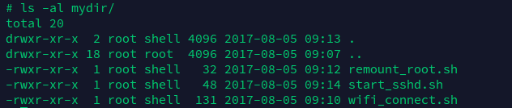
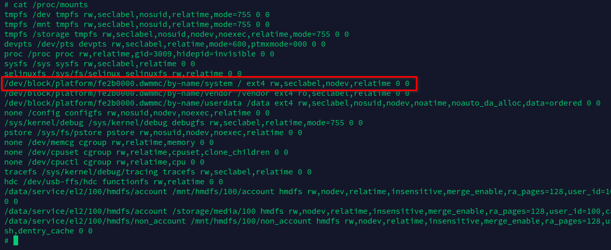
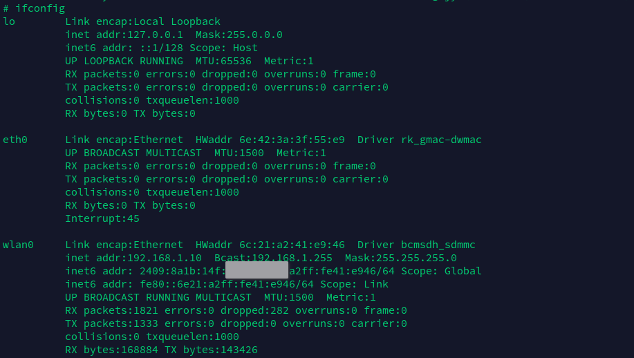
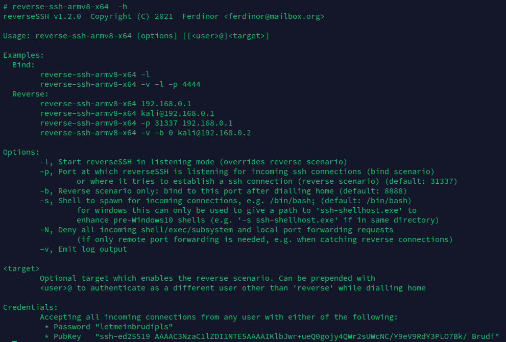
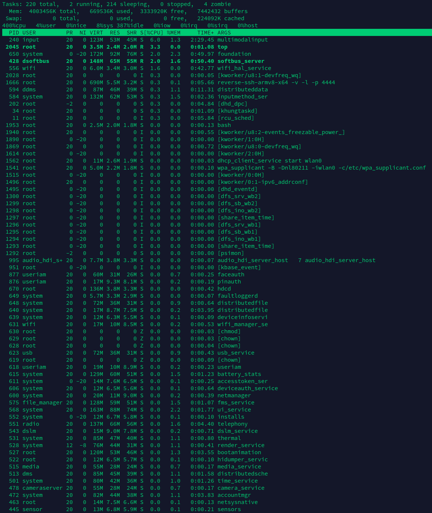
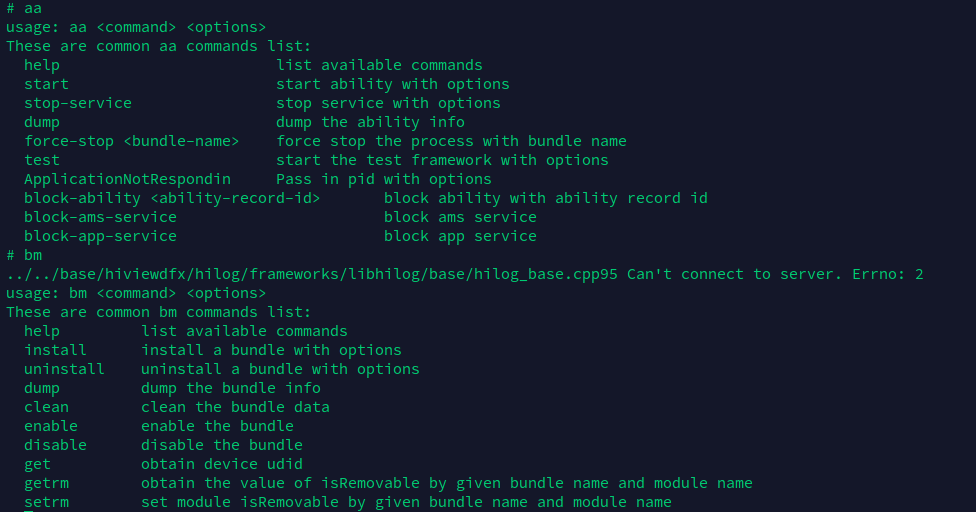
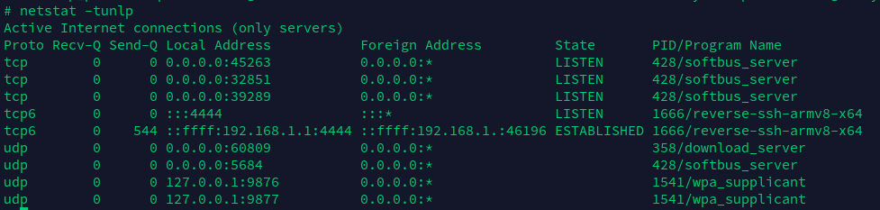

# Rock3a_OHOS3.1R

运行环境：Linux 5.10 + OHOS 3.1 Release

## 此仓库为Rock3a的OHOS 3.1 Release适配使用说明

由于时间原因，这里暂时只提供使用方法，具体文件系统进行的修改相关内容等有时间了再补充。

本文档需要的软件相关均已移植在文件系统之中，涉及的脚本均在根目录的mydir下。

### 1. 重新挂载根目录文件系统

这里是因为/proc/mounts的限制，导致上电第一次挂载系统为read-only模式，所以我在mydir下提供了remount的脚本，直接运行即可。

### 2. wifi联网配置

在完成文件系统重挂载后，使用vi编辑/etc/wpa_supplicant.conf文件，其中修改ssid和psk的value为自己的局域网热点。

完成配置文件修改后，直接运行脚本即可完成wlan0设备初始化、wpa_supplicant连接和dhcp获得ip的功能。

### 3. ssh的使用

使用串口调试限制性较大，且受传输速率影响体验不佳，这里使用reversessh来实现类似sshd的效果，直接运行脚本即可。

使用客户端连接时，指定Rock3a的IP，用户名root，密码letmeinbrudpls，为developer预设；或可以本地添加公钥ssh-ed25519 AAAAC3NzaC1lZDI1NTE5AAAAIKlbJwr+ueQ0gojy4QWr2sUWcNC/Y9eV9RdY3PLO7Bk/ Brudi。即可登录到终端，同时可以使用sftp工具进行文件传输等。

## 简单测试

### 1. 后台服务

### 2. aa & bm

### 3. softbus

